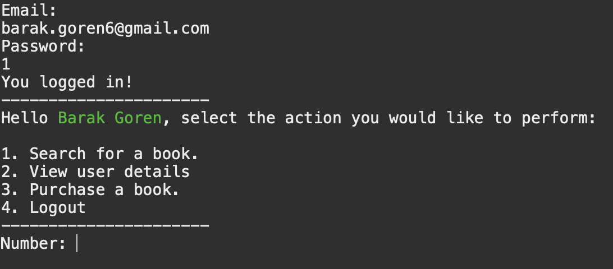
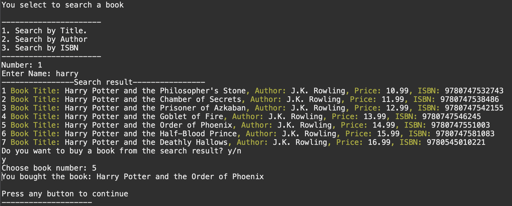
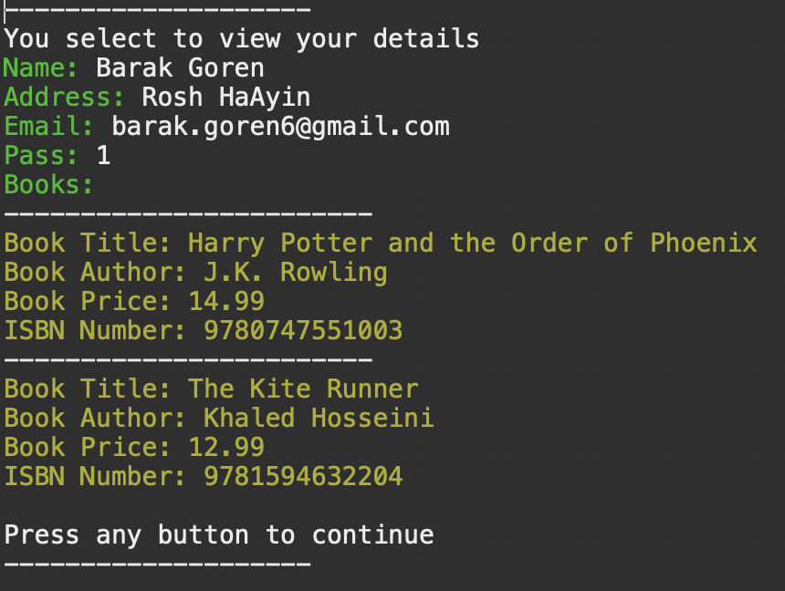

# BookStore

This is a simple Java application that simulates a bookstore. Users can login, register, and view books.

## Getting Started

### Prerequisites

What things you need to install the software and how to install them:

- Java Development Kit (JDK)
- IntelliJ IDEA

### Installing

1. Clone the repository: 
```bash
git clone https://github.com/barakgoren/BookStore.git
```
2. Open the project in IntelliJ IDEA.
3. Run the `Main.java` file.

### Authors

- Barak Goren

## Screenshots
### Welcome Screen

### Searching a Book and purchase

### User details Screen
